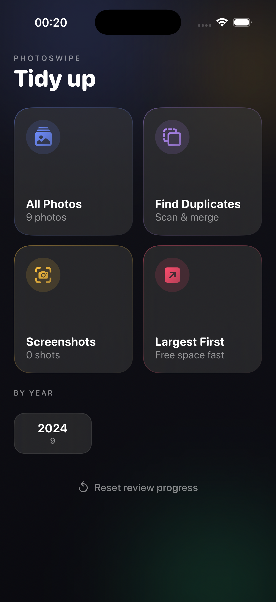
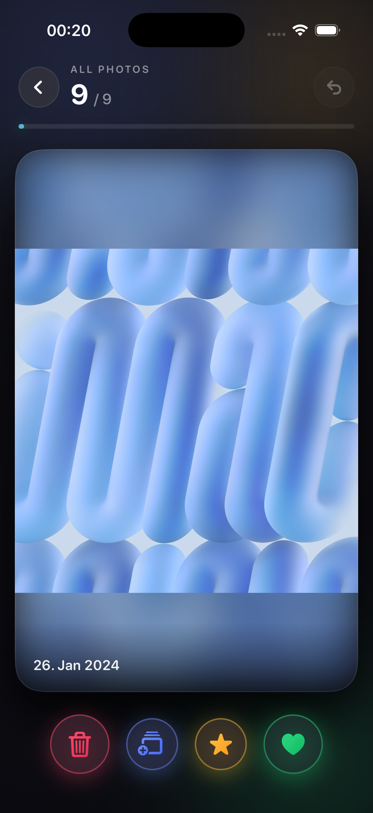
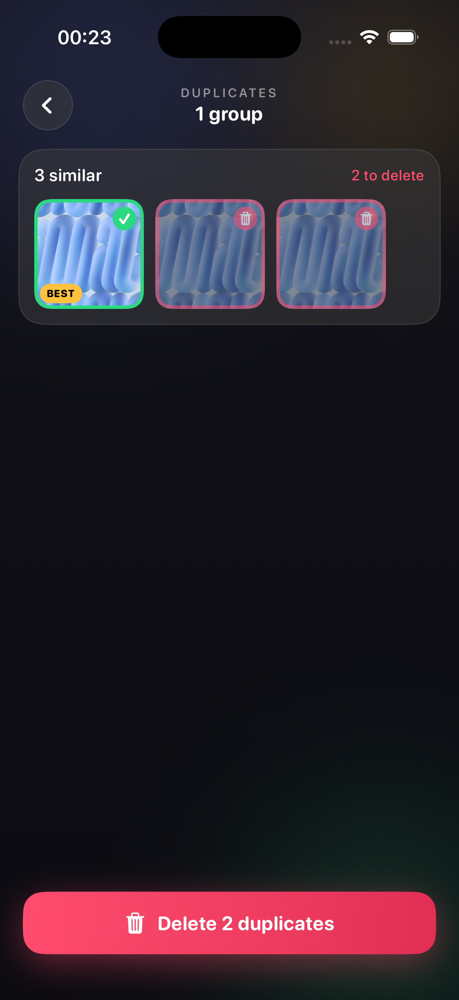
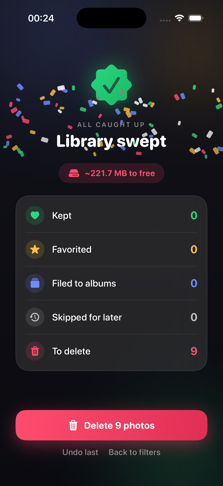

<div align="center">


# PhotoSwipe

**Clean up your iPhone photo library by swiping — Tinder-style.**

Swipe left to trash, right to keep, up to favorite, down to skip. Find duplicates, free up storage, and organize into albums — all **100% on-device**, private, and free.

[](#requirements)
[](https://swift.org)
[](https://developer.apple.com/xcode/swiftui/)
[](LICENSE)
[](#contributing)

<br/>


<sub><a href="PhotoSwipe/docs/demo.mp4">Watch the full-quality video</a> · made with <a href="https://remotion.dev">Remotion</a></sub>

</div>

---

## Overview

Got thousands of photos you'll never sort through? PhotoSwipe turns the dreadful
chore of cleaning your camera roll into a fast, satisfying swipe game.

Pick what to review (everything, screenshots, biggest files, a year, or
duplicates), then flick through your photos one card at a time. Nothing is
deleted until **you** confirm it through iOS's own deletion dialog — and deleted
photos still land in **Recently Deleted (30 days)**, so mistakes are recoverable.

> No account. No servers. No tracking. Your photos never leave your phone.

## Screenshots

| Pick a source | Swipe to decide | Find duplicates | Freed space + stats |
|:---:|:---:|:---:|:---:|
|  |  |  |  |

## Features

### Swipe to sort
- **Left → Trash**, **Right → Keep**, **Up → Favorite**, **Down → Skip for later**
- Tap the **album** button to file a photo into an existing or new album
- A depth-stacked card deck with spring physics, haptics, and per-direction intent stamps
- **Undo** the last swipe anytime

### Built for huge libraries (7,000+ photos)
- **Pause & resume** — every decision is remembered, so you continue exactly where you stopped
- **Delete the batch you swiped so far** without finishing the whole library — a "Delete N" button appears mid-run
- A leftover trash queue is offered on the home screen if you quit mid-session
- **Sources** to break the job into chunks: All Photos · Screenshots · Largest First · by Year

### Duplicate detection (on-device)
- Finds near-identical photos and burst shots using a **perceptual difference hash (dHash)** + **average-color** matching + PhotoKit burst grouping
- Auto-suggests the highest-resolution copy as the keeper (**BEST**), pre-selects the rest for deletion
- Tap any thumbnail to flip keep/trash, then bulk-delete

### Know your impact
- **Freed-space estimate** before you commit a deletion
- **Lifetime analytics** dashboard: total storage reclaimed, photos deleted, duplicates removed, cleanup sessions
- A little confetti when you finish a run

### Safe by design
- Deletions go through **iOS's native confirmation** sheet
- Deleted photos remain in **Recently Deleted** for 30 days
- Favoriting and album-filing use the standard Photos APIs — fully reversible in Photos

## Gesture cheat-sheet

| Gesture | Action |
|---|---|
| Swipe **right** / heart button | Keep |
| Swipe **left** / trash button | Queue for deletion |
| Swipe **up** / star button | Favorite |
| Swipe **down** | Skip for later (reappears next session) |
| **Album** button | Add to an album (create new inline) |
| **Delete N** (header) | Delete everything swiped-to-trash so far |
| **Undo** | Revert the last decision |

## Privacy

PhotoSwipe is fully **offline**. It requests photo-library access only to show,
favorite, organize, and (on your confirmation) delete your photos. There is no
networking code, no analytics SDK, no account, and no data collection. Lifetime
stats and review progress are stored locally in `UserDefaults` on your device.

## Requirements

- **iPhone** running **iOS 17.0** or later (built and tested through iOS 26)
- A **Mac** with **Xcode 16** or later (to build & install)
- An **Apple ID** (a free one works — see the 7-day note below)

---

## Installation & Setup (build it yourself)

There is no App Store build yet — you install it from source with Xcode. A
**free Apple ID** is enough. Takes ~10 minutes the first time.

### 1. Clone the repo

```bash
git clone https://github.com/noluyorAbi/photoswipe-ios.git
cd photoswipe-ios
```

### 2. Open the project

```bash
open PhotoSwipe/PhotoSwipe.xcodeproj
```

(or open `PhotoSwipe/PhotoSwipe.xcodeproj` from Xcode → File → Open.)

### 3. Set up signing (free Apple ID)

1. In Xcode's left sidebar, select the **PhotoSwipe** project, then the
   **PhotoSwipe** target.
2. Open the **Signing & Capabilities** tab.
3. Tick **Automatically manage signing**.
4. **Team →** *Add an Account…* → sign in with your Apple ID → pick your
   *(Personal Team)*.
5. Change the **Bundle Identifier** to something unique to you, e.g.
   `com.yourname.PhotoSwipe` (the default may already be taken).

### 4. Enable Developer Mode on your iPhone

iOS blocks running self-built apps until Developer Mode is on:

- **Settings → Privacy & Security → Developer Mode → On**
- The phone restarts; after reboot tap **Turn On** and enter your passcode.

> *(Developer Mode only appears in Settings after a Mac has connected to the phone at least once.)*

### 5. Connect and run

1. Plug your iPhone into the Mac. On the phone, tap **Trust This Computer** and enter your passcode.
2. In Xcode's top toolbar, set the run destination to **your iPhone** (not a simulator).
3. Press **the Run button** (or `Cmd + R`).

### 6. Trust the developer profile

The first launch is blocked by iOS. On the phone:

- **Settings → General → VPN & Device Management → [your Apple ID] → Trust**

Reopen **PhotoSwipe** from the home screen and grant **Full Access** to your
photo library when prompted (limited access weakens favorite/album/delete).

### The 7-day note (free accounts)

Apps signed with a **free** Apple ID expire after **7 days** — the icon stays,
but it won't launch. Just reconnect and press **the Run button** in Xcode again to refresh
for another 7 days. A paid **Apple Developer Program** account ($99/yr) extends
this to a year and removes the limit.

> Tip: in Xcode → *Window → Devices & Simulators → your iPhone →* enable
> **Connect via network** so you can re-sign over Wi-Fi without a cable.

### Run in the Simulator (optional)

You can also run it on the iOS Simulator (no device or signing needed), but the
Simulator's photo library is nearly empty. Add test photos by dragging images
onto the Simulator window, or:

```bash
xcrun simctl addmedia booted /path/to/photo.jpg
```

---

## Troubleshooting

| Symptom | Fix |
|---|---|
| **"Developer Mode disabled"** when running | Enable it: Settings → Privacy & Security → Developer Mode → On, then reboot. |
| **"Communication with Apple failed / no devices"** in Signing | Connect your iPhone first, then press the Run button — the profile is generated on first run. |
| App won't open after a few days | Free-account signing expired (7 days). Reconnect and run from Xcode again. |
| **"Untrusted Developer"** on launch | Settings → General → VPN & Device Management → trust your Apple ID. |
| Simulator build fails: *"No simulator runtime version available"* | Your installed Simulator runtime doesn't match the SDK. Install a matching iOS runtime in Xcode → Settings → Components, or build to a real device. |
| Library looks empty in the Simulator | Expected — add photos with `xcrun simctl addmedia booted <file>` or test on a real device. |
| Photos won't favorite/delete | You probably granted *Limited* access. Re-grant **Full Access** in Settings → Privacy → Photos → PhotoSwipe. |

---

## Architecture

PhotoSwipe is a single-target SwiftUI app using **MVVM** over **PhotoKit**.

```
PhotoSwipe/
├─ PhotoSwipeApp.swift          # App entry
├─ Models/
│  ├─ PhotoLibraryService.swift # PhotoKit wrapper: fetch, image load, favorite, album, delete, sizes
│  ├─ PhotoSource.swift         # Review sources + library facets
│  ├─ SwipeAction.swift         # Decision model (keep/trash/favorite/skip/album)
│  ├─ DuplicateFinder.swift     # dHash + average-color + burst grouping (union-find)
│  ├─ ReviewStore.swift         # Persisted "already decided" set (resume)
│  ├─ PendingTrashStore.swift   # Persisted trash queue (pause / batch delete)
│  └─ StatsStore.swift          # Lifetime analytics
├─ ViewModels/
│  └─ SwipeDeckViewModel.swift  # @MainActor state machine: loading→picker→{swiping|duplicates}→review
├─ Views/
│  ├─ RootView.swift            # Phase router + aurora background
│  ├─ SourcePickerView.swift    # Home screen tiles + stats hero + pending-trash banner
│  ├─ SwipeDeckView.swift       # Card deck, gestures, action bar, mid-run delete
│  ├─ PhotoCardView.swift       # Card: fitted photo over blurred fill, intent stamps
│  ├─ DuplicatesView.swift      # Duplicate groups review
│  ├─ ScanningView.swift        # Scan progress ring
│  ├─ ReviewView.swift          # End-of-run summary + confetti + commit
│  ├─ StatsView.swift           # Lifetime analytics dashboard
│  ├─ AlbumPickerView.swift     # Album chooser / creator
│  └─ Thumbnail.swift           # Async grid thumbnail
└─ Support/
   ├─ Theme.swift               # Colors, gradients, motion tokens, haptics, aurora
   └─ Confetti.swift            # Celebration burst
```

**How duplicate detection works:** each candidate's 160px thumbnail is reduced to
a 9×8 grayscale **difference hash** (64-bit structure fingerprint) plus an
**average RGB color**. Two photos are duplicates when their hash Hamming distance
is small **and** their average colors match (so same-shape/different-color images
aren't falsely grouped), or when they share a PhotoKit burst identifier.
Comparisons run only within a small time-sorted neighbour window, keeping it
near-linear for large libraries.

### Tech stack
SwiftUI · PhotoKit (`PHPhotoLibrary`, `PHCachingImageManager`) · Core Graphics ·
Swift Concurrency · MVVM. No third-party dependencies.

## Roadmap

- [ ] Video support
- [ ] iOS 18 tinted / dark app-icon variants
- [ ] Home-screen widget ("N photos to review")
- [ ] Before/after device free-space (`volumeAvailableCapacity`)
- [ ] Per-session freed-space chart
- [ ] Limited-access photo-picker flow
- [ ] App Store release (replace the private `PHAssetResource.fileSize` size lookup first)

## Contributing

Contributions are welcome! This is a small, focused, no-dependency codebase —
a great place to learn SwiftUI + PhotoKit.

1. Fork the repo and create a branch: `git checkout -b feature/my-thing`
2. Keep the style: SwiftUI + MVVM, no third-party deps, on-device only.
3. Build clean (no warnings) against iOS 17+.
4. Open a PR with a clear description and a screenshot/GIF for UI changes.

Found a bug or have an idea? [Open an issue](../../issues).

## Disclaimer

PhotoSwipe deletes photos from your library (with your confirmation, into
Recently Deleted). Use at your own risk and keep a backup (iCloud Photos / a
computer) before mass-cleaning. The author is not responsible for lost data.

> The size estimate uses an undocumented `PHAssetResource.fileSize` value via
> KVC. It works reliably for personal/sideloaded builds but counts as private-API
> access and must be replaced before any App Store submission.

## License

[MIT](LICENSE) © 2026 Alperen Adatepe

## Acknowledgements

- Built with Apple's **PhotoKit** and **SwiftUI**.
- Duplicate detection inspired by classic **perceptual hashing** (dHash).
- Not affiliated with the unrelated [PhotoSwipe](https://photoswipe.com) JavaScript gallery.
